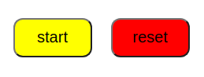
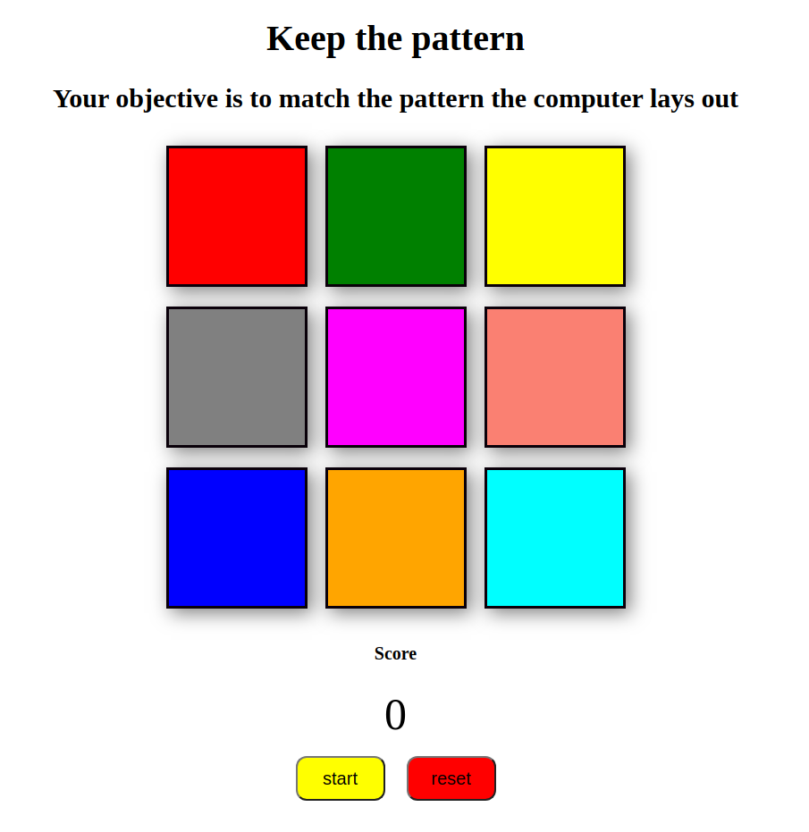

# Keep the Pattern

This game involves the computer laying down a pattern of colored blocks, which the player must then match. The pattern will get progressively longer, adding an additional block each round. 

# HOW TO PLAY

Once the player presses the start button one square on the grid will light up at random. It is then up to the player to match that pattern. Once the player matches the pattern the computer will then take another turn, adding an additional square to the end of the pattern. This alternating will continue until the player is unable to match the computer's pattern. 

Start by clicking the start button pictured below:

## Start Up Screen:

# HOW IT WORKS
When the game initializes two empty arrays are created, one to store the players moves, and one to store the computer's moves. When the computer has control it will generate a random number that corresponds to one of the nine blocks in the table. The block will be lit up for the player to see by adding a class to that block which reduces the opacity by 50% for 200 milliseconds (using a setTimeout function). The random number the computer selected will then be appended to their array of completed moves. The player then, with an empty array will make an effort to mimic what the computer has done. Each time the user clicks on a square the number corresponding to that square will be pushed onto the users array. Once the user array is the same length as the computer array they are compared. If they are equal, the player has accurately matched the computer's pattern and play continues. If they are not equal the player has failed to match the pattern and the game is over. 

# FUTURE CONSIDERATIONS

Currently the player can click on blocks while it is the computers turn. I believe I can disable this with the following code:
`document.getElementById("button").disabled = true;`

